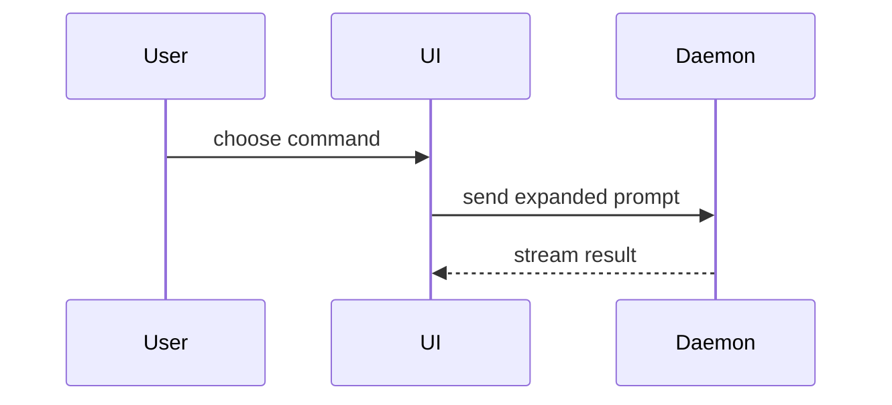

# PR 正文（pr）

用这个模板来写 PR 正文：

```markdown
## Summary

<图、diff 草图或树>

## Evidence

- **Before:** <截图/输出/失败的测试运行>
  **After:** <截图/输出/通过的测试运行>

## Merge Danger

**Door:** <单向门或双向门>

<可选：描述>

**Blast Radius:** <一个词的描述>

<可选：合并可能带来的后果>
```

## 各小节

跳过所有前言，正文保持简短。使用用户 `GLOSSARY.md` 里的领域语言。

### Summary

挑最小的视图把关键点讲清楚。

- 用伪代码展示逻辑或算法：

```text
on(save)
  if content is unchanged
    return cached result
  write new content
  return fresh result
```

- 用调用树展示运行时控制流：

```text
submitForm
  createSession
    persistPrompt
    launchAgent
  navigateToSession
```

- 用组件树展示 UI 结构，包含要紧的状态和模块边界：

```text
<SessionPage> (apps/example/src/routes/session.tsx)
  useSessionEvents()
  <SessionToolbar>
    <RunSkillButton> (packages/ui)
```

- 用浅层文件树展示文件职责或一次大范围重构：

```text
src/
├── commands/       # 解析用户操作
├── sessions/       # 持有会话状态
└── transport/      # 发送 API 请求
```

- 用 Mermaid 展示组件交互、控制流或数据流：



- 当要点是「变了什么」且周围形状已经存在时，用 `diff`。让 diff 的形状匹配主题。

对于组件改动：

```diff
 <SessionPage>
   useSessionEvents()
   <SessionToolbar>
+    <RunSkillButton />
   <SessionTimeline>
+    <SkillResultCard />
```

对于文件布局改动：

```diff
 src/
 ├── commands/
+│   └── show-me.ts       # 展开该斜杠命令
 ├── sessions/
-└── transport.ts
+└── transport/
+    ├── client.ts
+    └── stream.ts
```

对于调用树或调用栈改动：

```diff
 submitForm
   createSession
     persistPrompt
+    expandSkillMention
     launchAgent
-  navigateToSession
+  navigateToSession
+    subscribeToEvents
```

对于状态或控制流改动：

```diff
 on(save)
-  write content
+  if content is unchanged
+    return cached result
+  write new content
+  invalidate cache
```

- 当大部分是新增、当省略上下文会掩盖归属或顺序、或当用户需要一个可复制的目标形状时，展示整块：

```ts
function expandSkill(command: string): string {
  const skillName = command.slice(1);
  return `use the ${skillName} skill`;
}
```

#### 指引

把每个可视化图放在它所支撑的那段短文字旁边。只保留回答用户当前问题、或解决当前讨论点所需的那几个调用、文件、props、状态和边界。

你可以用其中一种，也可以用几种，但不太可能全用上。用你的判断，别把用户淹没。

### Evidence

改动确实生效的具体证据。展示一个 before 和 after。

截图是 S 级 —— 当环境已为此搭好、且改动是视觉性的。

基于执行的证据是 A 级。测试结果、控制台输出。用伪代码展示那条现在会失败、现在会通过的确切测试。

### Merge Danger

描述它是单向门还是双向门。双向门可以走回来，单向门不行。一个回滚成本低的 PR 风险更低。涉及破坏性操作或难以逆转的决策的改动是单向门。

影响半径（blast radius）是这个 PR 引入的改动的潜在影响或范围。考虑所有可能性。例如布局抖动、对使用方的破坏、移动端响应式等。

## 来源与致谢

- **技能（skill）**：show-me
- **作者（author）**：Dex Horthy
- **组织（organisation）**：Humanlayer
- **URL**：https://github.com/humanlayer/skills/blob/main/plugins/show-me/skills/show-me/SKILL.md

**Summary** 小节的那份可视化菜单（伪代码、调用树、组件树、文件树、Mermaid、diff）及其摆放指引，来自 [Dex Horthy](https://github.com/dexhorthy) 的 [`show-me`](https://github.com/humanlayer/humanlayer) 技能，几乎逐字照搬，只是把目标从实时对话改成了 diff。`pr` 并不把 `show-me` 当作技能依赖（它不属于本仓库，硬依赖会破坏独立安装），所以内容是被复制进来而不是指过去；这份文件就是原本由依赖承载的署名。详见 [CREDITS.md](references/CREDITS.md)。
