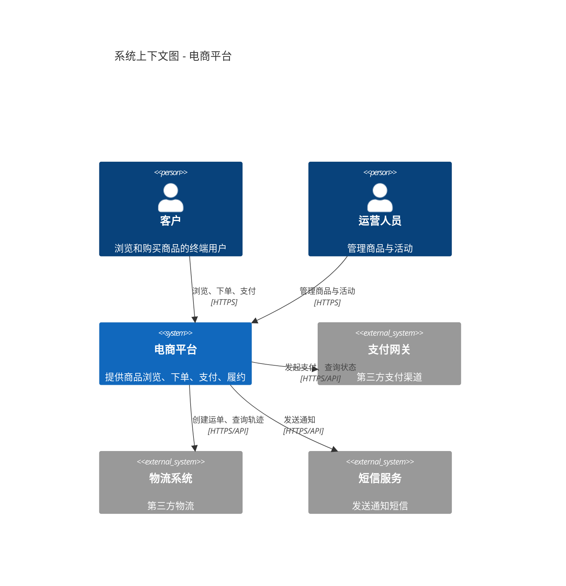
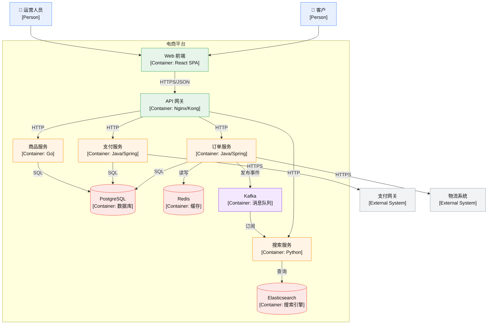
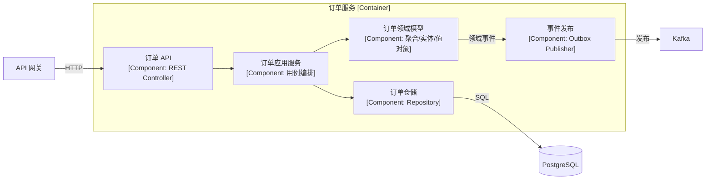
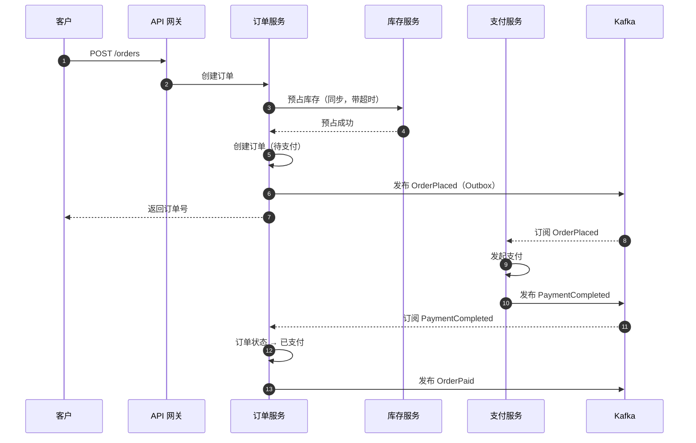
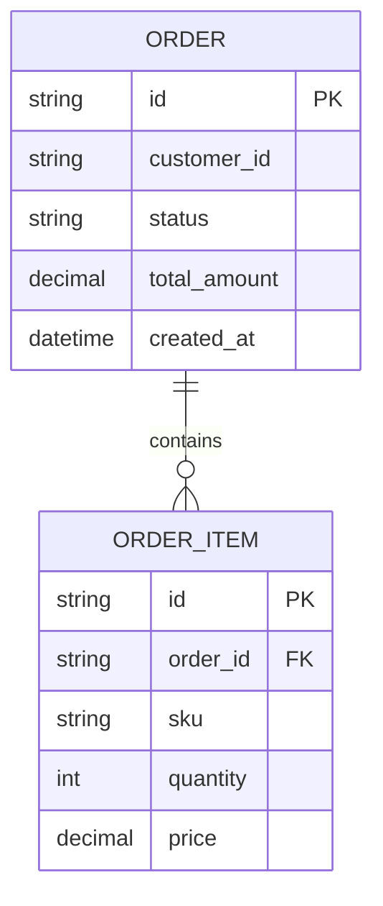
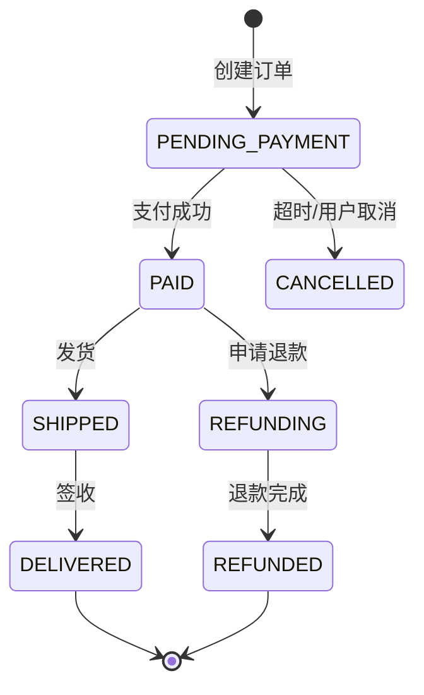

# C4 模型与图表模板

> C4 由 Simon Brown 提出，用**四个抽象层次**组织架构图，解决"一张图混所有层次"的问题。
> 完整说明见 `references/10-practice-and-communication.md`。

## 1. 四层概览

| 层 | 名称 | 画什么 | 受众 | 元素 |
|---|------|--------|------|------|
| L1 | **Context** | 系统与外部世界 | 所有人（含非技术） | Person、System |
| L2 | **Container** | 可部署单元 | 技术管理者、架构师 | 应用、服务、数据库、MQ |
| L3 | **Component** | 容器内的模块 | 架构师、开发者 | Controller、Service、Repository |
| L4 | **Code** | 类/接口 | 开发者 | 类、接口（**通常不画**） |

> ⚠️ **Container ≠ Docker 容器。** C4 的 Container 指"可独立运行/部署的单元"（Web 应用、API 服务、数据库、消息队列、SPA）。

## 2. 元素与关系速查

| 元素 | 说明 | 命名建议 |
|------|------|---------|
| **Person** | 使用者角色（非具体人） | "客户"、"运营人员" |
| **System（内部）** | 你负责的系统 | 系统名 |
| **System（外部）** | 你不控制的外部系统 | "支付网关（外部）" |
| **Container** | 可部署单元 | "订单服务"、"PostgreSQL"、"Kafka" |
| **Component** | 容器内模块 | "订单应用服务"、"订单仓储" |
| **关系** | 用动词描述交互 | "提交订单"、"读取"、"发布事件" |

**关系必须标注**：
- 协议/技术（HTTP、gRPC、SQL、AMQP）
- 方向（单向箭头）
- 同步/异步

## 3. Mermaid 骨架

### 3.1 L1 系统上下文图



> 若渲染环境不支持 `C4Context`，用普通 `flowchart` 替代，见 §3.4。

### 3.2 L2 容器图



### 3.3 L3 组件图（以订单服务为例）



### 3.4 关键流程时序图（下单）



## 4. 常见画法错误

| 错误 | 纠正 |
|------|------|
| 一张图混所有抽象层次 | 分层画（Context / Container / Component 分开） |
| Container 图里画类 | 类属于 L4，通常不画 |
| 把 Docker 容器当 C4 Container | C4 Container = 可部署单元 |
| 箭头不标协议 | 标注 HTTP/gRPC/SQL/AMQP + 同步/异步 |
| 不标技术选型 | Container 图上写清具体技术 |
| 画"数据库表"在 Container 层 | 表属于数据模型，单独画 ER 图 |
| 图用画图工具画（会过期） | 用 Mermaid/PlantUML 文本格式，进版本库 |
| 缺图例 | 加图例说明元素类型 |
| 关系太密（一张图 50 个箭头） | 拆图；只画关键交互 |

## 5. 文档组织建议

```
docs/architecture/
├── README.md              # 索引 + 阅读顺序
├── context.md             # L1 系统上下文
├── containers.md          # L2 容器
├── components/
│   ├── order.md           # L3 订单服务组件
│   └── payment.md         # L3 支付服务组件
├── sequences/
│   ├── place-order.md     # 下单时序
│   └── refund.md          # 退款时序
├── deployment.md          # 部署视图
├── quality-attributes.md  # 驱动因素 + 质量属性场景
└── data.md                # 数据模型与归属
```

**原则**：
- 图表用文本格式（Mermaid），可 diff、可评审、可版本管理
- 每个文档有明确所有者
- 过期即删除（错误的文档比没有更糟）
- 重点写"为什么"，不是"是什么"

## 6. 补充视图（C4 之外）

C4 只覆盖**静态结构**，还需补充：

| 视图 | 用途 | 工具 |
|------|------|------|
| **部署图** | 物理/云拓扑（机房、可用区、K8s） | Mermaid flowchart / 云架构图 |
| **数据流图** | 数据从哪来、到哪去、存哪 | Mermaid flowchart |
| **ER 图** | 数据模型 | Mermaid erDiagram |
| **状态机图** | 关键实体状态流转 | Mermaid stateDiagram |
| **时序图** | 关键流程交互 | Mermaid sequenceDiagram |

### ER 图示例



### 状态机示例


